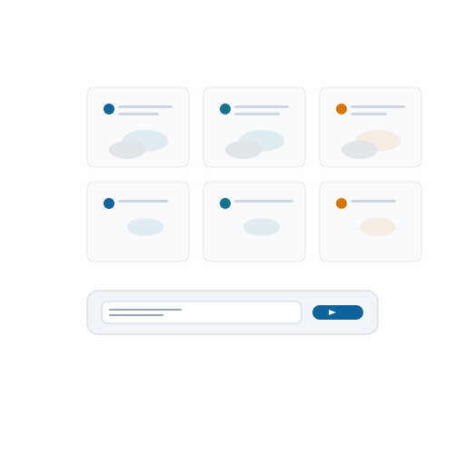
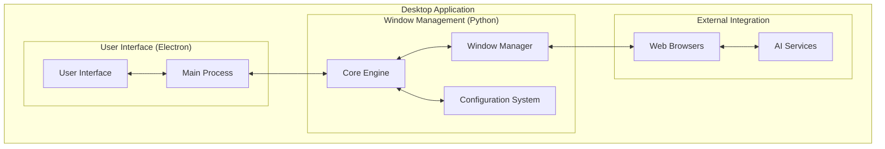
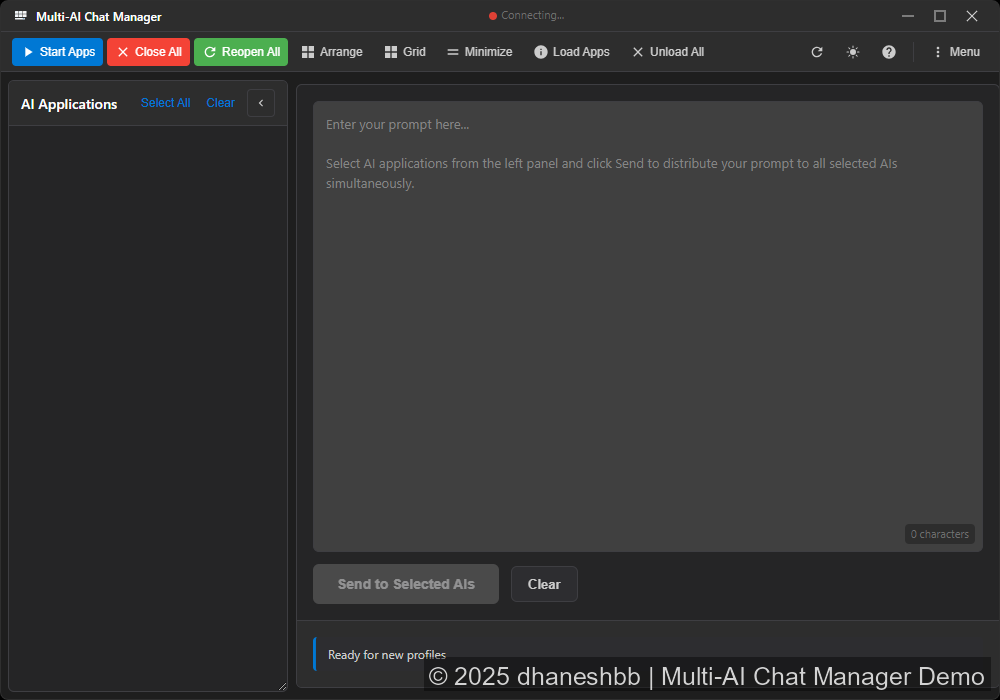
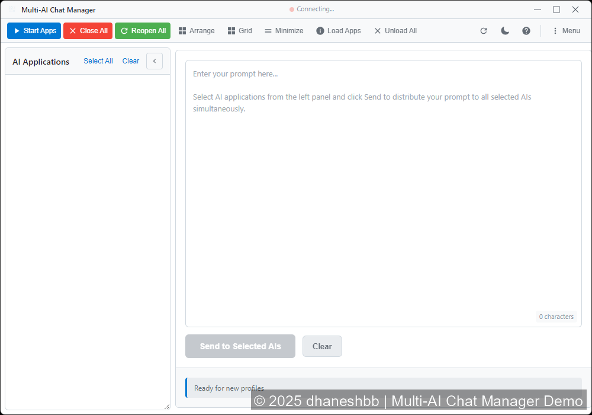

  

<h1 align="center">Multi-AI Chat Manager Demo</h1>

  
  
  
  
  
  
  

Documentation-only demo showcasing desktop application architecture for managing multiple AI chat services.

> **Important Notice**: This is a **documentation-only demo** showcasing the Multi-AI Chat Manager project concept. No executable code, proprietary assets, or third-party dependencies are included. See [Demo Limitations](docs/demo-limitations.md) and [Disclaimers](DISCLAIMERS.md) for complete details.

## Demo

*Screen recording of working prototype showing the application interface in action.*

## Overview

Multi-AI Chat Manager is a desktop application concept designed to streamline interactions with multiple AI chat services simultaneously. This tool manages browser-based AI applications, distributes prompts across services, and organizes workspace layouts for AI-powered conversations.

### Core Concept

Managing multiple AI chat interfaces becomes challenging when working on complex tasks that benefit from different AI perspectives. This project addresses that challenge by providing:

- **Unified Window Management**: Automatically detect, arrange, and control AI chat windows
- **Synchronized Prompt Distribution**: Send prompts to multiple AI services simultaneously
- **Window Layouts**: Grid and side-by-side arrangements for multi-AI workflows
- **Profile Management**: Support multiple user accounts per AI service
- **Desktop Integration**: Native OS integration with taskbar control and keyboard shortcuts

### Architecture Overview

The User Interface (Electron) provides desktop controls and communicates with Window Management (Python) for core operations. The Python component handles browser window management and configuration while connecting to AI services running in web browsers.

### Key Features

**Window Management:**
- Automatically finds browser-based AI application windows using configurable patterns
- Arranges windows in grids or side-by-side layouts across multiple monitors
- Controls window states - minimize, restore, or close all AI application windows at once
- Brings specific AI services to the front when needed

**Prompt Distribution:**
- Selectable AI services for prompt delivery
- Uses clipboard to send text to active windows
- Batch operations for refreshing, closing, or restarting multiple sessions

**Configuration:**
- Uses YAML files for easy-to-read settings
- Changes apply immediately without restarting
- Supports multiple user accounts for each AI service
- Custom ordering for how windows get arranged

**Interface:**
- Clean desktop app built with Electron
- Dark and light themes available
- Shows real-time status of AI applications
- Keyboard shortcuts for quick actions

| Dark Theme | Light Theme |
|------------|-------------|
|  |  |

### Use Cases

**Research & Analysis:**
- Compare responses from multiple AI models on complex queries
- Gather diverse perspectives for problem analysis
- Cross-reference information across different AI knowledge bases

**Content Creation:**
- Generate multiple content variations simultaneously
- Leverage different AI strengths (creative, technical, analytical)
- Streamline review and comparison workflows

**Development & Learning:**
- Get coding assistance from multiple AI assistants
- Compare implementation approaches and best practices
- Explore different AI reasoning styles for educational purposes

### Technical Specifications

- **User Interface (Electron)**: Desktop UI with modern web technologies
- **Window Management (Python)**: Core engine with Windows API integration
- **Communication**: JSON-RPC protocol over stdin/stdout
- YAML-based configuration with hot reloading and schema validation
- Process isolation with input validation
- **Platform**: Windows 10/11 with native API integration
- Works with Chromium-based browsers (Chrome, Edge, etc.)

## Documentation

- [**Technical Architecture**](docs/architecture.md) - Detailed system design with Mermaid diagrams
- [**Features**](docs/features.md) - Feature descriptions and capabilities
- [**Usage Examples**](docs/usage.md) - Workflow demonstrations and best practices
- [**Demo Limitations**](docs/demo-limitations.md) - What's included in this demo

## Code Examples

- [**Window Detection**](docs/examples/window-detection.py) - AI service detection concepts
- [**Configuration Management**](docs/examples/config-management.py) - Settings validation
- [**Electron Bridge**](docs/examples/electron-bridge.js) - Communication protocol

## Getting Started

Since this is a documentation-only demo, getting started means exploring the concept:

1. **Read the [Architecture](docs/architecture.md)** to understand the technical design
2. **Review [Features](docs/features.md)** to understand capabilities
3. **Study [Code Examples](docs/examples/)** to see implementation concepts
4. **Check [Usage Examples](docs/usage.md)** for workflow demonstrations

## Contributing

This demo showcases concepts and architectural approaches. Contributions welcome for:

- Documentation improvements and clarifications
- Additional architectural diagrams and explanations
- Additional code examples and educational content
- Use case expansions and workflow documentation

---

## Legal & Copyright

**License**: MIT | **SPDX**: MIT | **Details**: [NOTICE](NOTICE), [COPYRIGHT](COPYRIGHT), [DISCLAIMERS.md](DISCLAIMERS.md)

### Copyright Notice

© 2025 dhaneshbb.

- **UI Design**: Visual interface design is copyright protected
- **Documentation & Concepts**: Freely available under MIT License
- **Code Examples**: Freely available under MIT License

### Important Notes

- **Educational Purpose**: This demo is for concept demonstration and educational use only
- **AI Service Terms**: Users should respect AI service Terms of Service and use official APIs
- **No Working Code**: This repository contains no executable implementations
- **Original Content**: All documentation and examples created specifically for this demo

---

**Version**: v0.0.1 | **Type**: Documentation Demo | **Status**: Complete

*This README provides a complete overview of the Multi-AI Chat Manager concept demonstration. For detailed technical information, please explore the documentation in the `/docs` directory.*
