# Technical Architecture

## Table of Contents

- [System Overview](#system-overview)
- [Component Architecture](#component-architecture)
  - [User Interface Layer (Electron)](#user-interface-layer-electron)
  - [Window Management Layer (Python)](#window-management-layer-python)
- [Data Flow Architecture](#data-flow-architecture)
  - [Configuration Flow](#configuration-flow)
  - [Window Management Flow](#window-management-flow)
- [Communication Protocol](#communication-protocol)
  - [JSON-RPC Message Structure](#json-rpc-message-structure)
  - [Message Format Specification](#message-format-specification)
- [Window Management Architecture](#window-management-architecture)
  - [Detection Engine](#detection-engine)
  - [Arrangement Engine](#arrangement-engine)
- [Multi-Display Support](#multi-display-support)
- [Security Architecture](#security-architecture)
  - [Process Isolation](#process-isolation)
  - [Validation Pipeline](#validation-pipeline)
- [Performance Optimization](#performance-optimization)
  - [Caching Strategy](#caching-strategy)
  - [Parallel Processing](#parallel-processing)
- [Error Handling Architecture](#error-handling-architecture)

## System Overview

The Multi-AI Chat Manager employs a hybrid desktop architecture combining Python for system-level operations and Electron for modern UI presentation.

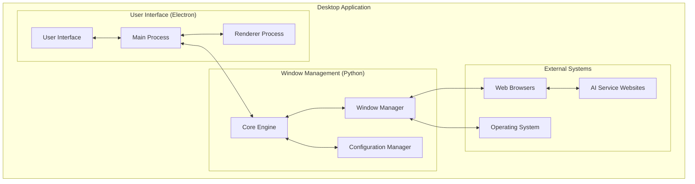

The application consists of two main components: User Interface (Electron) for desktop interaction, and Window Management (Python) for core operations. The Python component communicates with the operating system to manage windows and connects to AI services through web browsers.

## Component Architecture

### User Interface Layer (Electron)

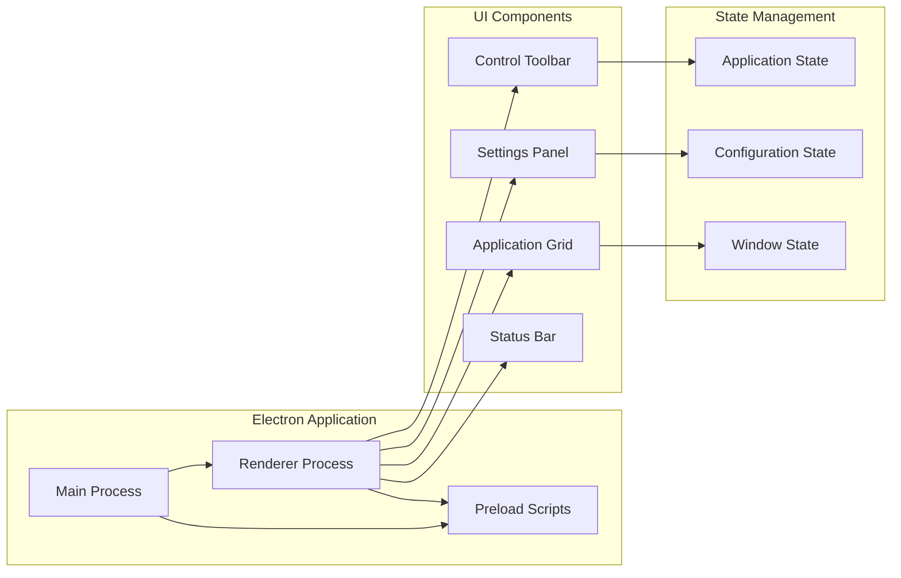

The User Interface (Electron) consists of a main process handling security and system access, while the renderer process displays the interface. Components include a toolbar for controls, a grid displaying AI applications, settings panels for configuration, and a status bar showing current activity.

### Window Management Layer (Python)

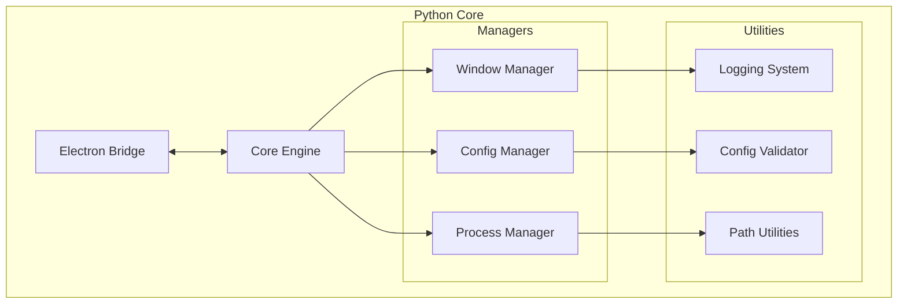

Window Management (Python) is organized into specialized managers: the Window Manager handles browser windows, Config Manager processes settings, and Process Manager launches applications. Support utilities provide logging, validation, and file path operations.

## Data Flow Architecture

### Configuration Flow

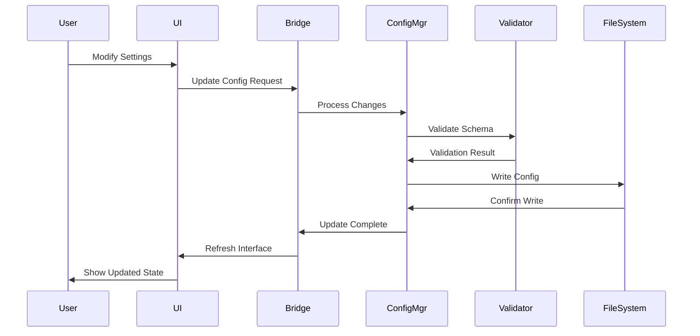

Configuration changes flow through validation to ensure correctness, get persisted to files, then trigger interface updates to reflect the new settings.

### Window Management Flow

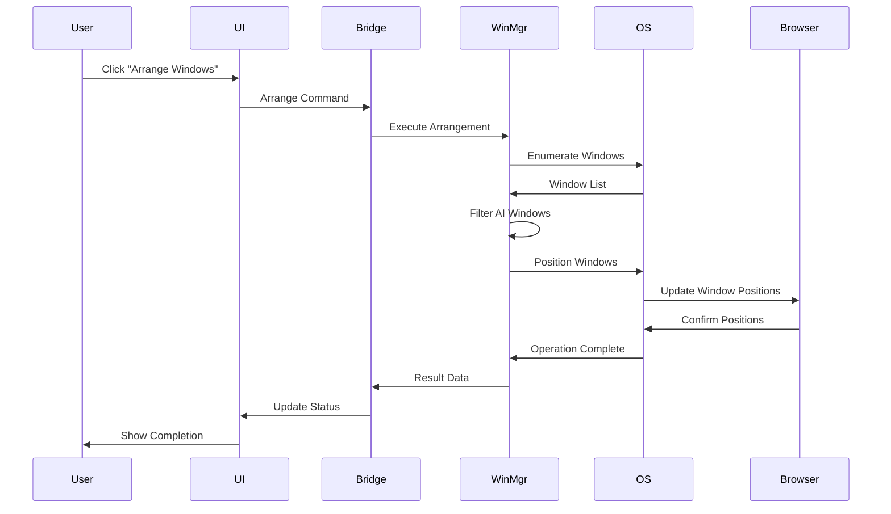

Window arrangement executes by requesting a list of all open windows from the operating system, filtering for AI application windows, then instructing the OS to position each browser window.

## Communication Protocol

### JSON-RPC Message Structure

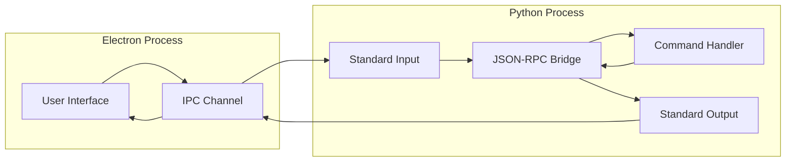

The User Interface (Electron) communicates with Window Management (Python) through standard input/output channels using JSON-RPC format for inter-process communication.

### Message Format Specification

**Request Structure:**
```json
{
  "jsonrpc": "2.0",
  "id": "unique-request-id",
  "method": "window_operation",
  "params": {
    "action": "arrange",
    "layout": "grid",
    "dimensions": {"cols": 4, "rows": 2}
  }
}
```

**Response Structure:**
```json
{
  "jsonrpc": "2.0",
  "id": "unique-request-id",
  "result": {
    "success": true,
    "windows_arranged": 6,
    "failed_operations": 0
  }
}
```

## Window Management Architecture

### Detection Engine

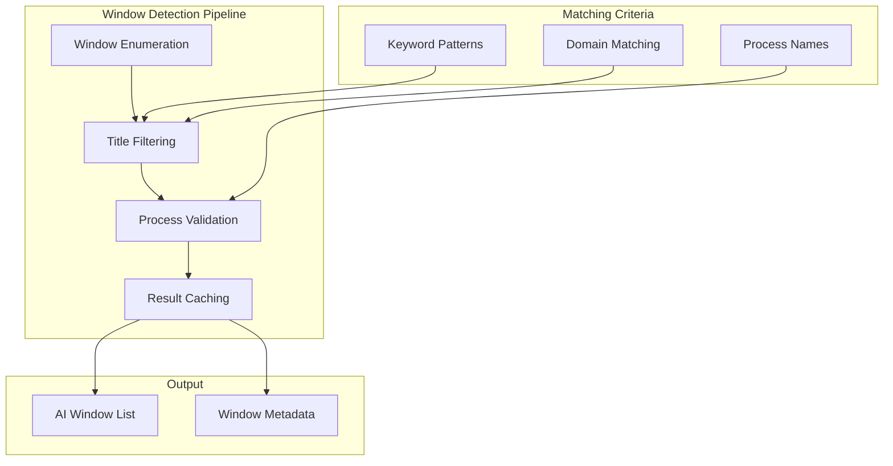

The detection engine finds AI windows by examining all open windows, matching their titles against configured patterns (like "ChatGPT" or "Claude"), verifying browser process ownership, then caching results to avoid immediate re-scanning.

### Arrangement Engine

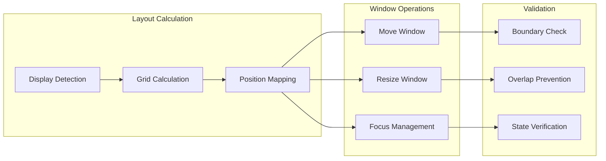

The arrangement engine determines screen layout and calculates grid positions, then moves and resizes each window to fit while ensuring windows remain on-screen and non-overlapping.

## Multi-Display Support

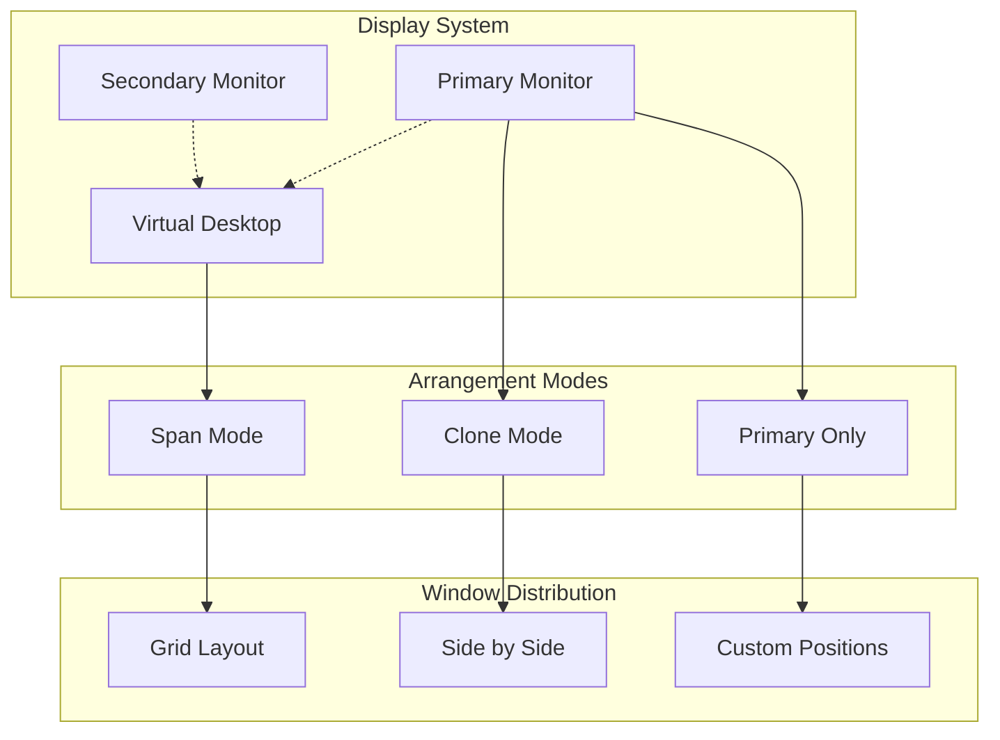

Multi-monitor configurations support spanning windows across all screens for maximum space, duplicating layouts on each screen, or restricting to the primary monitor. The application automatically detects display configurations and presents appropriate options.

## Security Architecture

### Process Isolation

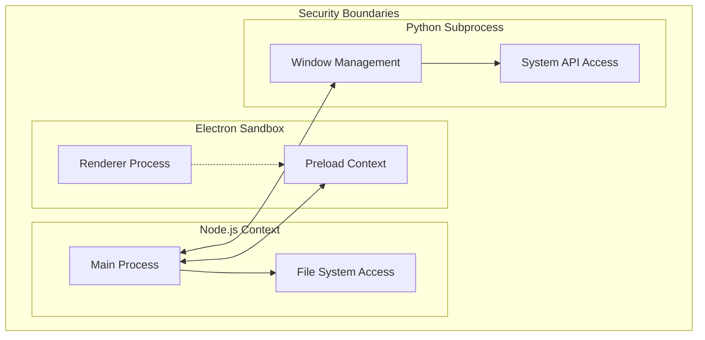

The application maintains security through process isolation: the renderer interface runs in a sandbox with limited permissions, the main process handles files safely, and Window Management (Python) runs in its own process with controlled system access.

### Validation Pipeline

```mermaid
graph LR
    subgraph "Input Validation"
        UserInput[User Input]
        Sanitize[Input Sanitization]
        TypeCheck[Type Validation]

        UserInput --> Sanitize
        Sanitize --> TypeCheck
    end

    subgraph "Configuration Validation"
        Schema[Schema Validation]
        PathCheck[Path Validation]
        Security[Security Scan]

        TypeCheck --> Schema
        Schema --> PathCheck
        PathCheck --> Security
    end

    subgraph "Execution Safety"
        Sandbox[Sandbox Check]
        Privileges[Privilege Validation]
        Execute[Safe Execution]

        Security --> Sandbox
        Sandbox --> Privileges
        Privileges --> Execute
    end
```

## Performance Optimization

### Caching Strategy

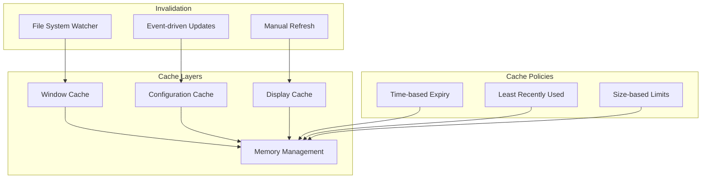

### Parallel Processing

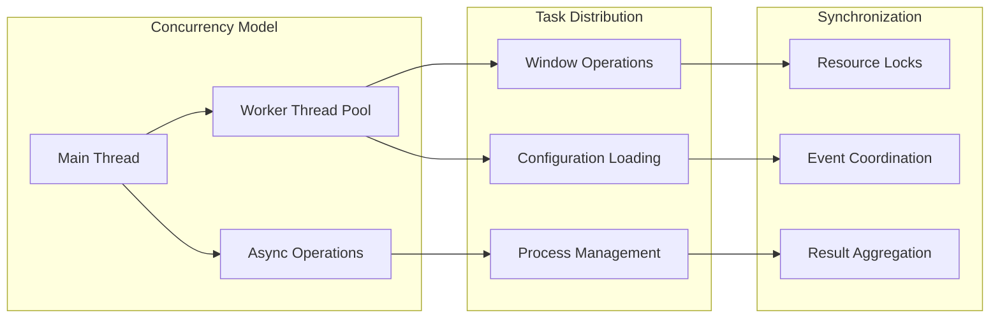

## Error Handling Architecture

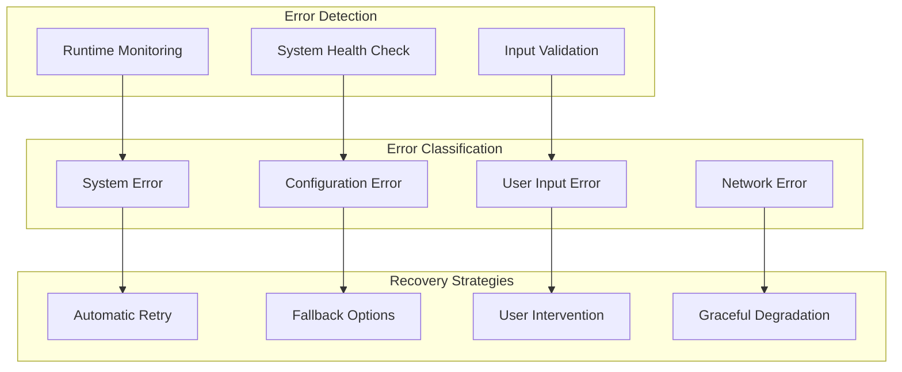

This architecture ensures reliable and secure operation while keeping components separated and using resources efficiently.