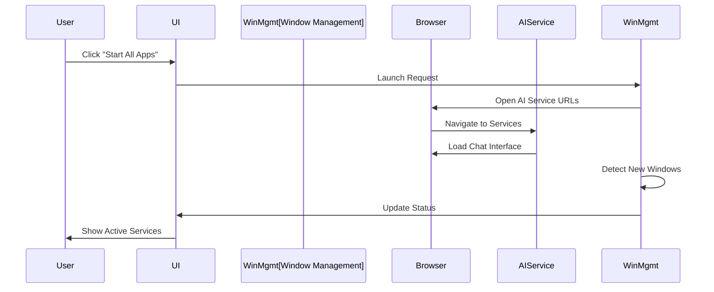
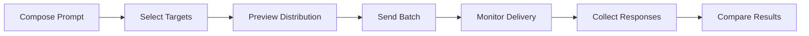
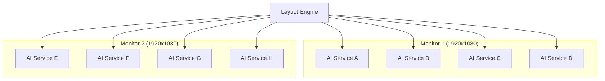
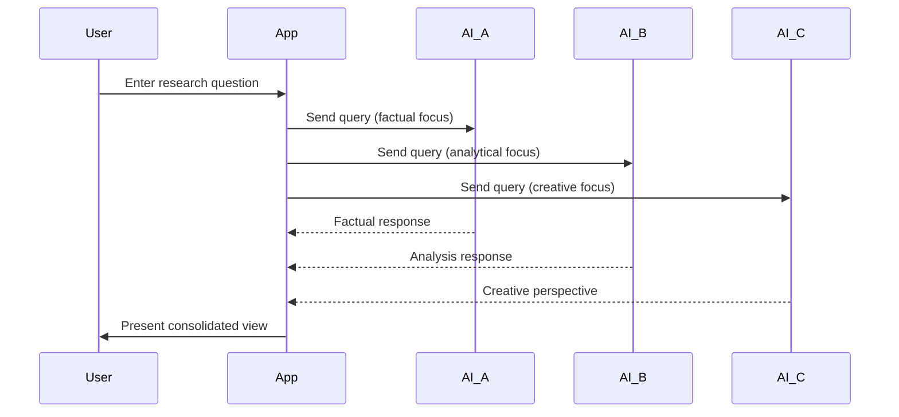

# Usage Guide

> **Important**: This is a documentation-only demo. The usage examples describe conceptual workflows but do not include actual executable functionality. See [Demo Limitations](demo-limitations.md) for details.

## Table of Contents

- [Getting Started](#getting-started)
  - [Initial Setup Workflow](#initial-setup-workflow)
- [Core Workflows](#core-workflows)
  - [Window Management Operations](#window-management-operations)
  - [Prompt Distribution](#prompt-distribution)
  - [Configuration Management](#configuration-management)
- [Extended Features](#extended-features)
  - [Multi-Monitor Workflows](#multi-monitor-workflows)
  - [Automation Workflows](#automation-workflows)
  - [Productivity Workflows](#productivity-workflows)
- [Keyboard Shortcuts](#keyboard-shortcuts)
  - [Global Shortcuts](#global-shortcuts)
  - [Application Shortcuts](#application-shortcuts)
  - [Window Management](#window-management)
- [Troubleshooting Common Issues](#troubleshooting-common-issues)
  - [Window Detection Problems](#window-detection-problems)
  - [Arrangement Issues](#arrangement-issues)
  - [Performance Issues](#performance-issues)
- [Best Practices](#best-practices)
  - [Configuration Management](#configuration-management-1)
  - [Window Management](#window-management-1)
  - [Security Practices](#security-practices)

## Getting Started

### Initial Setup Workflow

1. **First Launch**
   ```
   Application Startup Sequence:
   ├── Load Configuration
   ├── Validate AI Service Definitions
   ├── Initialize Window Detection
   ├── Launch User Interface
   └── Display Setup Wizard (if first run)
   ```

2. **Configuration Wizard**
   - **AI Service Detection**: Automatically scan for existing AI chat windows
   - **Profile Setup**: Configure user profiles for each AI service
   - **Layout Preferences**: Choose default window arrangement (grid vs. side-by-side)
   - **Display Settings**: Configure multi-monitor preferences

3. **Initial Testing**
   - Launch a few AI services manually
   - Test automatic detection
   - Verify window arrangement functionality
   - Configure any missed services

## Core Workflows

### Window Management Operations

#### Starting AI Applications



The startup process begins when Window Management (Python) opens browser windows to each AI service's website, waits for them to load, then automatically detects the new windows and updates the interface to show active services.

**Steps:**
1. Click "Start All Apps" in the toolbar
2. Application launches configured AI services
3. Wait for services to load (typically 3-5 seconds per service)
4. Services appear in the application grid with status indicators
5. Auto-arrangement applies if enabled

#### Arranging Windows

**Grid Layout (4x2 Default):**
```
┌─────────────────────────────────────────────────────────┐
│ ┌─────────┐ ┌─────────┐ ┌─────────┐ ┌─────────┐         │
│ │AI Svc A │ │AI Svc B │ │AI Svc C │ │AI Svc D │         │
│ └─────────┘ └─────────┘ └─────────┘ └─────────┘         │
│                                                         │
│ ┌─────────┐ ┌─────────┐ ┌─────────┐ ┌─────────┐         │
│ │AI Svc E │ │AI Svc F │ │AI Svc G │ │AI Svc H │         │
│ └─────────┘ └─────────┘ └─────────┘ └─────────┘         │
└─────────────────────────────────────────────────────────┘
```

**Side-by-Side Layout:**
```
┌─────────────────────────────────────────────────────────┐
│ ┌───────────┐ ┌───────────┐ ┌───────────┐ ┌───────────┐ │
│ │           │ │           │ │           │ │           │ │
│ │AI Service │ │AI Service │ │AI Service │ │AI Service │ │
│ │     A     │ │     B     │ │     C     │ │     D     │ │
│ │           │ │           │ │           │ │           │ │
│ │           │ │           │ │           │ │           │ │
│ │           │ │           │ │           │ │           │ │
│ │           │ │           │ │           │ │           │ │
│ └───────────┘ └───────────┘ └───────────┘ └───────────┘ │
└─────────────────────────────────────────────────────────┘
```

#### Prompt Distribution

**Basic Prompt Sending:**
1. Select target AI services from the grid
2. Enter prompt in the text area
3. Click "Send to Selected" button
4. Monitor delivery status in real-time

**Prompt Workflow Process:**


### Configuration Management

#### AI Service Configuration

**Adding New AI Service:**
1. Open Settings panel
2. Navigate to "AI Applications" section
3. Click "Add New Service"
4. Configure service details:
   ```yaml
   name: "New AI Service"
   enabled: true
   priority: 10
   keywords:
     - "new-ai-service.com"
     - "new ai assistant"
   user_profile: "default"
   app_path: "C:\\Path\\To\\Shortcut.lnk"
   ```

**Profile Management:**
```
Profile Structure:
├── Service A
│   ├── Personal Profile
│   ├── Work Profile
│   └── Research Profile
├── Service B
│   ├── Default Profile
│   └── Team Profile
└── Service C
    └── Main Profile
```

#### Layout Customization

**Grid Configuration:**
- **Columns**: 1-6 (recommended: 3-5)
- **Rows**: 1-4 (recommended: 2-3)
- **Spacing**: Adjustable gaps between windows
- **Margins**: Screen edge padding

**Display Configuration:**
- **Primary Monitor**: Use main display only
- **Multi-Monitor Span**: Spread across all displays
- **Specific Monitor**: Target particular display
- **Custom Region**: Define specific screen area

## Extended Features

### Multi-Monitor Workflows

#### Span Mode Configuration


**Setup Process:**
1. Connect multiple monitors
2. Configure display arrangement in Windows
3. Set application to "Span Mode"
4. Define grid dimensions (e.g., 4x4 across two monitors)
5. Test arrangement with current AI services

#### Monitor-Specific Targeting
- **Research Monitor**: AI services for information gathering
- **Work Monitor**: AI services for task completion
- **Communication Monitor**: AI services for collaboration

### Automation Workflows

#### Startup Automation
```yaml
# Startup sequence configuration
automation:
  startup:
    enabled: true
    delay: 5  # seconds
    sequence:
      - launch_ai_services
      - wait_for_load
      - arrange_windows
      - hide_taskbar_icons
      - minimize_to_tray
```

#### Scheduled Operations
```yaml
# Periodic maintenance
maintenance:
  window_refresh:
    interval: 300  # 5 minutes
    enabled: true

  config_reload:
    watch_files: true
    auto_apply: true

  health_check:
    interval: 60  # 1 minute
    auto_restart_failed: true
```

### Productivity Workflows

#### Research Workflow


**Steps:**
1. Arrange AI services in side-by-side layout
2. Select services with different strengths:
   - Factual information service
   - Analytical reasoning service
   - Creative thinking service
3. Send research question to all selected services
4. Compare and synthesize responses

#### Content Creation Workflow
1. **Brainstorming Phase**:
   - Send topic to creative AI services
   - Gather diverse perspectives and ideas

2. **Research Phase**:
   - Query factual AI services for background information
   - Verify claims and gather supporting data

3. **Writing Phase**:
   - Use writing-focused AI for structure and flow
   - Apply different AI services for various sections

4. **Review Phase**:
   - Send drafts to analytical AI for feedback
   - Refine based on multiple AI perspectives

#### Problem-Solving Workflow
```
Problem Analysis:
├── Technical AI → Implementation details
├── Strategic AI → High-level approach
├── Creative AI → Alternative solutions
└── Risk AI → Potential issues
```

## Keyboard Shortcuts

### Global Shortcuts
- **Ctrl+Alt+A**: Arrange all windows
- **Ctrl+Alt+M**: Minimize all AI windows
- **Ctrl+Alt+R**: Restore all AI windows
- **Ctrl+Alt+S**: Show/hide application
- **Ctrl+Alt+Q**: Quick prompt input

### Application Shortcuts
- **F5**: Refresh window detection
- **F11**: Toggle fullscreen mode
- **Ctrl+,**: Open settings
- **Ctrl+R**: Reload configuration
- **Esc**: Close current dialog

### Window Management
- **Ctrl+1-9**: Focus specific AI service
- **Ctrl+Shift+1-9**: Toggle AI service selection
- **Ctrl+Enter**: Send prompt to selected services
- **Ctrl+A**: Select all AI services
- **Ctrl+D**: Deselect all AI services

## Troubleshooting Common Issues

### Window Detection Problems

**Issue**: AI service not detected
**Solutions**:
1. Check if service title contains configured keywords
2. Verify browser process is running
3. Add additional keywords to service configuration
4. Restart window detection

**Issue**: False positive detection
**Solutions**:
1. Make keywords more specific
2. Add exclusion patterns
3. Verify process name matching

### Arrangement Issues

**Issue**: Windows overlap or don't fit properly
**Solutions**:
1. Check display resolution settings
2. Adjust grid dimensions
3. Verify taskbar and system UI spacing
4. Test with fewer windows first

**Issue**: Some windows don't move
**Solutions**:
1. Check if windows are maximized (unmaximize first)
2. Verify application has window focus permission
3. Try manual window focus before arrangement

### Performance Issues

**Issue**: Slow window operations
**Solutions**:
1. Reduce detection frequency in settings
2. Close unnecessary applications
3. Increase cache TTL values
4. Disable animations in Windows

**Issue**: High CPU usage
**Solutions**:
1. Increase detection interval
2. Reduce number of monitored services
3. Check for infinite loops in configuration
4. Monitor background processes

## Best Practices

### Configuration Management
- **Regular Backups**: Export configuration periodically
- **Version Control**: Track configuration changes
- **Documentation**: Comment complex configurations
- **Testing**: Validate changes in test environment

### Window Management
- **Consistent Browsers**: Use same browser for similar services
- **Profile Isolation**: Separate profiles for different workflows
- **Resource Management**: Monitor memory usage with many services
- **Regular Cleanup**: Close unused services periodically

### Security Practices
- **Profile Separation**: Use different profiles for different security levels
- **Access Control**: Limit file system permissions appropriately
- **Update Management**: Keep browser and application updated
- **Log Monitoring**: Review logs for unusual activity

---

*Note: This usage guide describes conceptual workflows and features. Actual functionality would require the complete application implementation, which is not included in this documentation-only demo.*